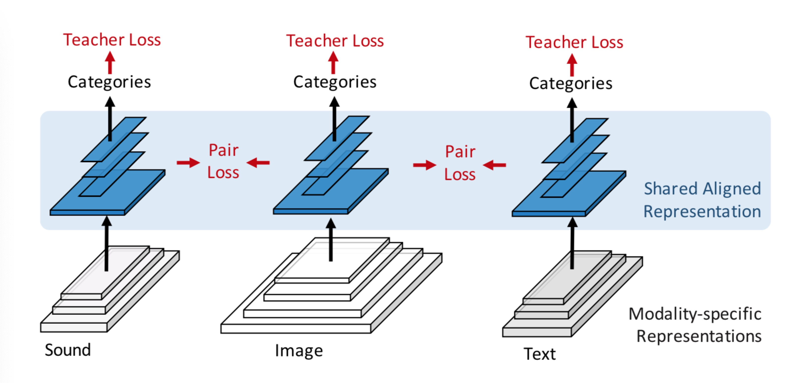
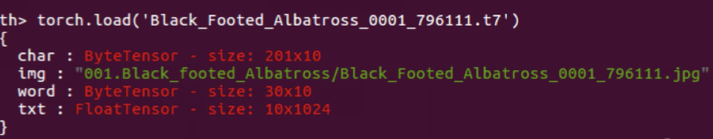

Pytorch implementation of paper 'See, Hear, and Read: Deep Aligned Representations' 
[[arxiv]](http://cn.arxiv.org/abs/1706.00932v1)

In this paper, a Teacher-Student model-like network is designed to learn a deep discriminative representations shared across three major natural modalities: vision, sound and language. The student network accepts input either an image, a sound, or a text, and produces correponding modality-specific representation (gray). The teacher network produces a common shared representation (blue) that is aligned across modality from the modality-specific representations. 



Experiment results show that this representation is useful for several tasks, such as cross-modal re- trieval or transferring classifiers between modalities. 

## Prerequisites
- Linux or OSX
- [Pytorch installation](https://pytorch.org/get-started/locally/) 
- 8G+ free memory 
- GPU with CUDA is recommended

## Get started
### Clone this repository
run command in terminal
```bash
git clone https://github.com/jingliao132/CrossModalRetrieval.git
cd CrossModalRetrieval
```
### Download the [CUB-200 dataset](http://www.vision.caltech.edu/visipedia/CUB-200.html)
```bash
./datasets/download_dataset.sh CUB_200_2011
```
will download the CUB-200 in datasets folder
### Download [CUB-200 caption data](https://drive.google.com/file/d/0B0ywwgffWnLLLUc2WHYzM0Q2eWc/view?usp=sharing)(torch format)
Each caption file contains a dict object with keys 'char', a character-level one-hot mapping of 10 text descriptions on the image; 'img', the file name of the image; 'word', word-level coding of 10 text descriptions and 'txt', 1024-dimentional text feature by pretrained GoogLeNet (Details in https://github.com/reedscot/icml2016). We use only 'char' and 'img'.



### New folder 'models' , and Download [pretrained word-to-vector model](https://drive.google.com/file/d/0B7XkCwpI5KDYNlNUTTlSS21pQmM/edit) (binary format) to 'models'
### Train the model
```bash
python3 __init__.py
```
### Customize train/val/test data
edit train.txt, val.txt, test.txt 

## Acknowledgement
@techreport{WelinderEtal2010,
	Author = {P. Welinder and S. Branson and T. Mita and C. Wah and F. Schroff and S. Belongie and P. Perona},
	Institution = {California Institute of Technology},
	Number = {CNS-TR-2010-001},
	Title = {{Caltech-UCSD Birds 200}},
	Year = {2010}
}
@inproceedings{reed2016generative,
  title={Generative Adversarial Text-to-Image Synthesis},
  author={Scott Reed and Zeynep Akata and Xinchen Yan and Lajanugen Logeswaran and Bernt Schiele and Honglak Lee},
  booktitle={Proceedings of The 33rd International Conference on Machine Learning},
  year={2016}
}
